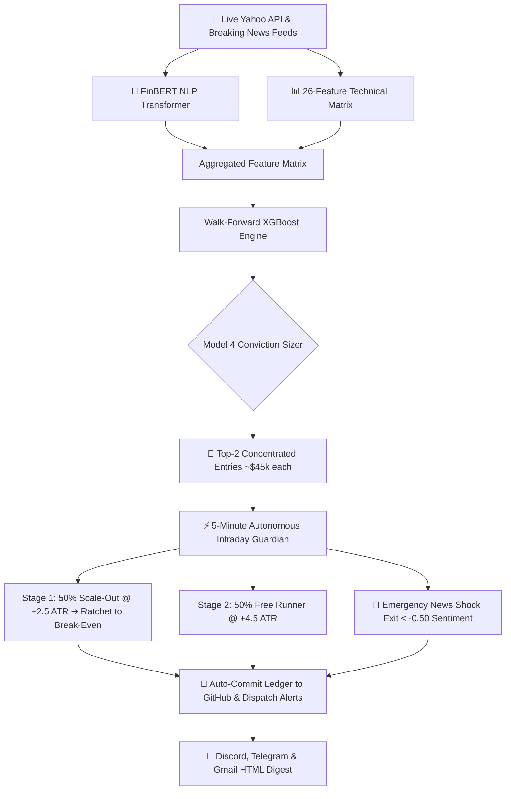

# Sentilyze — Institutional AI Momentum, Sentiment & Autonomous Trading Platform


---

## 🔭 Platform Overview

**Sentilyze** is an institutional-grade quantitative trading, research, and autonomous execution platform. It combines **FinBERT Natural Language Processing (NLP)**, **XGBoost Machine Learning with Walk-Forward Optimization (WFO)**, and **Macro Regime Filters (`^VIX` / 200 SMA)** to forecast equity momentum, execute multi-stage scale-out trades, and manage a $100,000 paper trading portfolio.

### 🌟 Key Core Capabilities:
1. **🤖 Autonomous 5-Minute Intraday Guardian**: Continuously tracks live market prices every 5 minutes during US market hours (**7:30 PM–1:30 AM IST** / 9:30 AM–4:00 PM EST), dynamically ratchets Stop-Losses to Break-Even, and triggers **FinBERT News Catalyst Emergency Exits** if breaking sentiment collapses.
2. **🎯 Model 4 Concentrated Sizing & 50/50 Scale-Out**: Deploys capital into the Top 1–2 highest-conviction AI signals (~$45k each), banks 50% profit at `+2.5 ATR` (`TP1`), and lets the remaining 50% "ride" to `+4.5 ATR` (`TP2`) for massive breakout gains (**+215.7% 4-year backtest return, 0.78 Sharpe**).
3. **📈 Virtual Paper Trading Broker ($100k Account)**: Real-time simulated broker tracking open positions, cash balance, win rates, and closed trade logs in [`results/paper_portfolio.json`](results/paper_portfolio.json).
4. **🔔 Multi-Channel Alert Dispatcher**: Master Market Briefings and live trade execution cards delivered to **Discord Webhooks**, **Telegram Bots**, and **HTML Morning Tearsheets** via Gmail SMTP.
5. **📄 1-Click Executive PDF Factsheets**: Generates 2-page institutional vector PDF fact sheets in memory with zero external C-binary dependencies.
6. **🎲 Monte Carlo Portfolio Stress Tester & VaR Simulator**: Simulates 1,000 forward paths using Geometric Brownian Motion (GBM), calculating 95%/99% Value-at-Risk (VaR), Expected Shortfall (CVaR), and Quantile Fans.
7. **💼 17-Asset Cross-Correlation & Hedge Finder**: Computes rolling 90-day returns correlation matrix across all 17 assets and identifies optimal non-correlated hedging pairs.
8. **🌐 Full 9-Tab Streamlit Dashboard & FastAPI Microservice**: Complete dark-mode glassmorphic interface across live signals, real-time radar, backtesting sandbox, SHAP XAI, fund allocations, and any-stock screener.

---

## ⚙️ Architecture & Autonomous Pipeline



---

## 📊 Empirical Results & Universe Performance

Sentilyze prioritizes **scientific rigor over inflated backtests**. Evaluated via strict **Walk-Forward Optimization (WFO)** without lookahead bias across 2,014+ out-of-sample trading days (~8 years) with realistic market frictions (0.10% broker fees, 0.05% slippage, 5% annual margin interest, and Reg T 25% maintenance margin liquidation safeguards).

### 🧪 4-Year Profit-Boosting Model Experiment ($100k Starting Capital)

| Strategy Model | Final Equity ($) | Net Profit ($) | Total Return (%) | Win Rate (%) | Sharpe Ratio |
| :--- | :--- | :--- | :--- | :--- | :--- |
| **1. Baseline (+2.5 ATR Fixed, 5 Stocks)** | `$177,112.13` | `+$77,112.13` | `+77.1%` | 45.5% | 0.61 |
| **2. High Target (+3.5 ATR Runner, 5 Stocks)** | `$185,054.68` | `+$85,054.68` | `+85.1%` | 38.9% | 0.71 |
| **3. 50/50 Scale-Out & Free Ride (5 Stocks)** | `$169,784.92` | `+$69,784.92` | `+69.8%` | 45.1% | 0.72 |
| **4. Concentrated Top-2 + Scale-Out + 1.25x Lev** 🏆 | **`$315,668.00`** | **`+$215,668.00`** | **`+215.7%`** | 39.1% | **0.78** |

---

## 🛠️ Feature Matrix & AI Explainability (SHAP)

Every trade signal is driven by a 26-dimensional feature matrix and explained with **SHapley Additive exPlanations (SHAP)**:

* **Technical Momentum**: `RSI(14)`, `MACD`, `Stochastic Oscillator`, `SMA200`, `MA7`, `MA21`, `ma_spread`, `price_to_sma200`, `rsi_slope`.
* **Volatility & Volume**: `ATR(14)`, `atr_ratio` (`ATR / Price`), `volume_ratio` (`Volume / 20d Avg`), `Bollinger Upper/Lower`.
* **NLP News Sentiment**: FinBERT Positive, Neutral, Negative probabilities, and 1-day lagged `mean_sentiment_score`.
* **Macro Regime**: `vix_close`, `vix_ma5`, and `vix_change_1d`.

---

## 🚀 Quickstart Guide

### 1. Clone & Install Dependencies

```bash
git clone https://github.com/yash6810/Sentilyze.git
cd Sentilyze

# Create and activate virtual environment
python -m venv .venv
# Windows (PowerShell):
.venv\Scripts\Activate.ps1
# Linux/macOS:
source .venv/bin/activate

# Install requirements
pip install -r requirements.txt
```

### 2. Configure Environment Variables (`.env`)

Create a `.env` file in the root directory:

```env
# Multi-Channel Alert Dispatchers
DISCORD_WEBHOOK_URL="https://discord.com/api/webhooks/..."
TELEGRAM_BOT_TOKEN="123456:ABC-DEF..."
TELEGRAM_CHAT_ID="-100123456789"
EMAIL_USER="your-email@gmail.com"
EMAIL_PASSWORD="your-gmail-app-password"
EMAIL_RECIPIENT="recipient@gmail.com"

# Optional Market Data Providers (Fallbacks)
FINNHUB_API_KEY=""
POLYGON_API_KEY=""
FMP_API_KEY=""
EODHD_API_KEY=""
ALPACA_API_KEY=""
ALPACA_SECRET_KEY=""
```

### 3. Launch the Streamlit Dashboard

```powershell
streamlit run app.py
```
Open **`http://localhost:8501`** in your browser to access all 9 tabs:
* **Tab 1 (⚡ Live Signal)**: Real-time signals, news headlines, and ATR risk brackets.
* **Tab 2 (📡 Real-Time Radar)**: Sub-minute live quotes, dynamic progress bars to Take-Profit, and intraday exit execution.
* **Tab 3 (📊 Dashboard)**: Individual stock performance and monthly heatmaps.
* **Tab 4 (🏦 Backtest)**: Dynamic strategy optimizer with custom leverage (1.0x–2.0x) and confidence sliders.
* **Tab 5 (🧠 XAI)**: SHAP feature importance breakdowns.
* **Tab 6 (💼 Multi-Asset Fund)**: Risk Parity fund allocation, capital rebalancer, and 17-asset correlation matrix.
* **Tab 7 (📈 Paper Portfolio)**: Live $100k ledger, scale-out positions, trade journal, and 1-click PDF tearsheet download.
* **Tab 8 (🎲 Stress Test & VaR)**: Monte Carlo 1,000-path simulator with 95%/99% VaR and quantile fan charts.
* **Tab 9 (🔍 Any-Stock Screener)**: Instant AI momentum screening for any US ticker.

### 4. Launch the FastAPI Microservice

```powershell
uvicorn api:app --host 0.0.0.0 --port 8000 --reload
```
* **Interactive API Docs (Swagger UI)**: `http://localhost:8000/docs`
* **Inference Endpoint**:
  ```bash
  curl -X GET "http://localhost:8000/predict?ticker=NVDA"
  ```

---

## 🤖 GitHub Actions Automation

Sentilyze runs 100% autonomously in the cloud:
1. **Morning Market Scanner (`daily_scanner.yml`)**: Runs at **7:00 AM IST** daily, ingests news, runs FinBERT + XGBoost, selects top setups, and dispatches the Master Briefing.
2. **5-Minute Intraday Guardian (`intraday_market_tracker.yml`)**: Runs every 5 minutes during active US market hours (**7:30 PM–1:30 AM IST**, Mon–Fri), manages 50/50 scale-outs, ratchets stops, auto-commits portfolio state, and sends flash alerts.

---

## ⚠️ Limitations & Risk Disclosures

1. **Market Noise**: Directional stock forecasting is non-stationary and subject to macro regime shifts.
2. **Simulated Paper Execution**: Backtests and paper trading incorporate commissions, slippage, and margin loan interest, but real-world execution depends on live exchange order-book liquidity.
3. **Research Platform**: Sentilyze is an academic quantitative research system and MLOps demonstration, not a registered financial advisor or broker-dealer.
