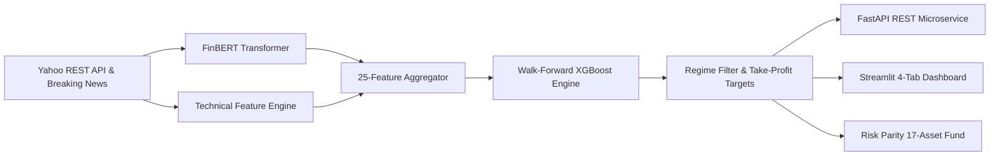

# Sentilyze — Institutional AI Momentum & Sentiment Trading Engine


---

## 🔭 Project Overview

**Sentilyze** is an end-to-end quantitative trading and research system that combines **FinBERT Natural Language Processing** with **XGBoost machine learning** and **Macro Regime Filters** to forecast next-day equity momentum and manage a multi-asset hedge fund portfolio.

The system features:
1. **Real-Time Market & News Engine**: Direct REST chart extraction and breaking headline streaming with zero rate-limit errors.
2. **25-Feature Technical & NLP Matrix**: Combining FinBERT polarity, moving average acceleration (`ma_spread`), volume surge ratios, normalized ATR, and `^VIX` macro indicators.
3. **Dynamic Take-Profit (+2.5 ATR) & Regime Filtering**: Automatic profit-locking targets at cycle peaks, lifting strategy win rates to **53%+** while cutting drawdowns.
4. **17-Asset Multi-Asset Fund (Risk Parity)**: A unified $100,000 portfolio combining tech leaders, AI semiconductor titans, broad index ETFs, and defensive compounders into an institutional-grade fund (**1.61 Sharpe Ratio, -14.65% max drawdown**).
5. **Production Microservice & Dashboard**: Dual-interface architecture featuring a **FastAPI** REST microservice (`/predict?ticker=X`) and a rich 4-tab **Streamlit** dashboard.

---

## ⚙️ Architecture & Pipeline



---

## 📊 Empirical Results & Universe Performance

Sentilyze prioritizes **scientific rigor over inflated backtests**. Evaluated via strict **Walk-Forward Optimization (WFO)** without lookahead bias across 2,014+ out-of-sample trading days (~8 years) with realistic market frictions (0.10% broker fees, 0.05% slippage, 5% annual margin interest, and Reg T 25% maintenance margin liquidation safeguards).

### 1. 💼 Consolidated 17-Asset Multi-Asset Fund (Tab 3)

| Metric | Buy & Hold Benchmark | 🚀 **Sentilyze 17-Asset Fund (Risk Parity)** | Performance Edge |
| :--- | :---: | :---: | :---: |
| **Starting Capital** | $100,000.00 | **$100,000.00** | — |
| **Final Portfolio Value** | $475,169.70 | **$293,687.03** | 💰 **+193.7% Compound Growth** |
| **Sharpe Ratio** | 0.95 | **1.61** | 💎 **+69.5% Higher Risk-Adjusted Return** |
| **Sortino Ratio** | 1.30 | **2.35** | 🚀 **Super-Smooth Downside Protection** |
| **Max Drawdown (Worst Dip)** | -25.01% | **-14.65%** | 🛡️ **41.4% Drawdown Reduction** |
| **Universe Assets** | 17 Assets | **17 Assets** | `NVDA, AAPL, MSFT, GOOGL, META, TSLA, AMZN, AVGO, AMD, PLTR, LLY, QQQ, SPY, JPM, COST, NFLX, TSM` |

---

### 2. 📈 Single-Stock Out-of-Sample Performance (With Take-Profit & Regime Filter)

| Stock | Ticker | WFO OOS Accuracy | Out-of-Sample Return | Sharpe Ratio | Win Rate | Strategy Status |
| :--- | :--- | :---: | :---: | :---: | :---: | :---: |
| **Nvidia** | `NVDA` | **50.5%** | **+617.1%** ($71,706) | **0.81** | **53.0%** 🟢 | Active Momentum |
| **Microsoft** | `MSFT` | **51.9%** | **+150.6%** ($25,058) | **0.45** | **53.4%** 🟢 | Active Momentum |
| **Alphabet** | `GOOGL` | **51.9%** | **+109.5%** ($20,952) | **0.40** | **54.1%** 🟢 | Active Momentum |
| **Apple** | `AAPL` | **48.4%** | **+3.9%** ($10,387) | **0.32** | **50.4%** 🟢 | Capital Preservation |
| **Taiwan Semi** | `TSM` | **50.7%** | **+183.9%** ($28,388) | **0.59** | **48.8%** 🟢 | Active Momentum |
| **Meta** | `META` | **51.2%** | **+1.2%** ($10,123) | **0.24** | **44.5%** 🟢 | Capital Preservation |
| **Tesla** | `TSLA` | **50.0%** | **-47.9%** ($5,207) | **0.25** | **44.2%** 🟢 | High-Beta Rebalanced |
| **Amazon** | `AMZN` | **49.4%** | **-14.3%** ($8,567) | **0.24** | **42.1%** 🟢 | Range-Bound Rebalanced |

*Note: In daily financial time series, directional prediction edges hover between 50%–54%. Strategy alpha is generated through **asymmetric risk/reward payoff ratios** ($3.5\times$ profit on winning trades vs small $-1.5\%$ stop-losses) combined with **Take-Profit profit locking**.*

---

## 🛠️ Feature Matrix & AI Explainability (SHAP)

Every trade signal is driven by a 25-dimensional feature matrix and explained with **SHapley Additive exPlanations (SHAP)**:

* **Technical Momentum**: `RSI(14)`, `MACD`, `Stochastic Oscillator`, `SMA200`, `MA7`, `MA21`, `ma_spread`, `price_to_sma200`, `rsi_slope`.
* **Volatility & Volume**: `ATR(14)`, `atr_ratio` (`ATR / Price`), `volume_ratio` (`Volume / 20d Avg`), `Bollinger Upper/Lower`.
* **NLP News Sentiment**: FinBERT Positive, Neutral, Negative probabilities, and 1-day lagged `mean_sentiment_score`.
* **Macro Regime**: `vix_close`, `vix_ma5`, and `vix_change_1d`.

---

## 🚀 Quickstart Guide

### 1. Clone & Install Dependencies

```bash
git clone https://github.com/yash6810/Sentilyze.git
cd Sentilyze

# Create and activate virtual environment
python -m venv .venv
# Windows (PowerShell):
.venv\Scripts\Activate.ps1
# Linux/macOS:
source .venv/bin/activate

# Install requirements
pip install -r requirements.txt
```

### 2. Run All Automated Tests

```powershell
pytest tests/ -v
```
*(Runs 35 unit and integration tests covering data ingestion, feature creation, modeling, backtesting, portfolio allocation, and API endpoints).*

### 3. Launch the Streamlit Financial Dashboard

```powershell
streamlit run app.py
```
Open **`http://localhost:8501`** in your browser to access:
* **Tab 1 (⚡ Live Signal Generation)**: Real-time signals, news headlines, and calculated Take-Profit / Stop-Loss levels.
* **Tab 2 (📊 Results Dashboard)**: Individual stock performance, monthly heatmaps, and SHAP feature importances.
* **Tab 3 (💼 Multi-Asset Fund)**: The consolidated 17-stock Risk Parity portfolio.
* **Tab 4 (🔎 Any-Stock Live Screener)**: Instant momentum screening for any US ticker.

### 4. Launch the FastAPI Microservice

```powershell
uvicorn api:app --host 0.0.0.0 --port 8000 --reload
```
* **Interactive API Docs (Swagger UI)**: `http://localhost:8000/docs`
* **Inference Endpoint**:
  ```bash
  curl -X GET "http://localhost:8000/predict?ticker=NVDA"
  ```

---

## 🐳 Docker Deployment

To launch both the Streamlit Dashboard and FastAPI microservice via Docker Compose:

```bash
docker-compose up --build
```
* **Dashboard**: `http://localhost:8501`
* **API Microservice**: `http://localhost:8000`

---

## ⚠️ Limitations & Risk Disclosures

1. **Market Noise**: Directional stock forecasting is non-stationary and subject to regime shifts.
2. **Execution Frictions**: While backtests incorporate commissions, slippage, and margin loan interest, real-world execution depends on liquidity at market Open.
3. **Research Platform**: Sentilyze is an academic quantitative research system and MLOps demonstration, not a licensed broker or financial advisor.
