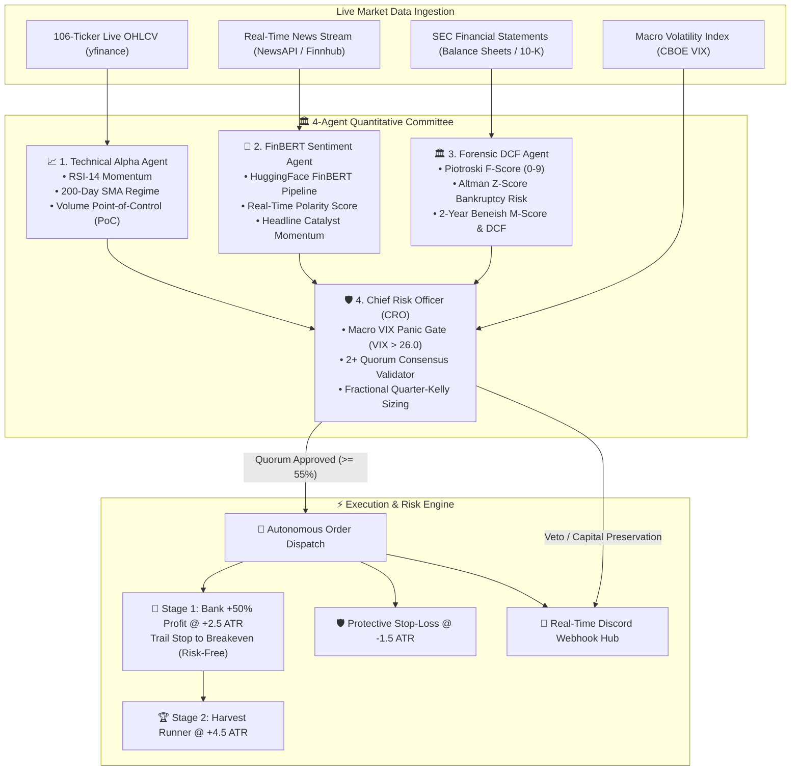

# Sentilyze — Autonomous Multi-Agent Quantitative Trading & NLP Intelligence Platform

<div align="center">

[](https://python.org)
[](https://github.com/psf/black)
[](.github/workflows/)
[](app.py)
[](src/alerts.py)
[](src/modeling.py)

<p align="center">
  <b>A 24/7 Autonomous Hybrid Quantitative Multi-Agent Trading Engine combining Deep Transformer NLP (FinBERT), Walk-Forward Machine Learning (XGBoost), 4-Agent Quorum Consensus, and Fractional Kelly Sizing across US Equities.</b>
</p>

[**🚀 Live Demo**](#-interactive-streamlit-app--dashboards) • [**🏛️ Multi-Agent Committee**](#-grounded-4-agent-deliberation-council) • [**📐 Kelly Sizing & Staged Scaling**](#-asymmetric-risk-management--staged-profit-scaling) • [**📊 Empirical Benchmarks**](#-empirical-alpha-attribution--benchmarks) • [**⚡ Quickstart**](#-quickstart-guide)

</div>

---

## 🌟 Why Sentilyze?

Traditional algorithmic trading systems rely either on rigid technical indicators or qualitative conversational LLM prompts. **Sentilyze pioneers the Hybrid Multi-Agent Quant paradigm**:

1. 🏛️ **4-Agent Quantitative Committee**: Gathers Technical Alpha, Transformer News NLP, Forensic SEC DCF Valuation, and Chief Risk Officer Arbitrator into an automated round-table quorum before any capital is committed.
2. 🤖 **24/7 Autonomous Cloud Daemon**: Runs continuously every 5 minutes during US market hours on GitHub Actions — zero local PC runtime required.
3. 📐 **Fractional Kelly Capital Allocation**: Eliminates arbitrary position sizing by dynamically calculating empirical mathematical edge: $f^* = \frac{p \cdot b - (1 - p)}{b}$.
4. 🎯 **2-Stage Staged Profit Scaler**: Banks $+50\%$ cash at $+2.5\times\text{ATR}$, immediately trails stop-loss to **Breakeven (Risk-Free)**, and lets runners target $+4.5\times\text{ATR}$.
5. 🛡️ **Zero-Hallucination Guarantee**: Unlike conversational LLM trading demos that hallucinate stock prices and metrics, Sentilyze uses **100% deterministic mathematical valuations** (Piotroski F-Score, Altman Z-Score, 2-Year Beneish M-Score, and Volume Point-of-Control).

---

## 🏛️ Grounded 4-Agent Deliberation Council



### Specialist Breakdown:
1. **📈 Agent 1: Technical Alpha Specialist**: Evaluates price momentum, RSI pullbacks, 21-day moving averages, and structural uptrends above the 200-day SMA.
2. **🧠 Agent 2: NLP Sentiment Specialist**: Extracts live headlines and scores semantic market optimism using HuggingFace's domain-specific `ProsusAI/finbert` transformer.
3. **🏛️ Agent 3: Forensic & Valuation Auditor**: Analyzes balance sheets to compute Piotroski F-Scores ($\ge 6$), Altman Z-Scores ($> 2.99$), Beneish manipulation metrics, and DCF margin of safety.
4. **🛡️ Agent 4: Chief Risk Officer (Arbitrator)**: Enforces macro volatility gates (halts trading if VIX spikes $> 26.0$), requires a 2-vote quorum, and computes Fractional Kelly capital allocation.

---

## 🎯 Asymmetric Risk Management & Staged Profit Scaling

The platform’s edge is anchored in **asymmetric risk-reward mechanics**:

$$\text{Risk-to-Reward Ratio} = \frac{+2.5\times\text{ATR} \text{ (Take Profit 1)}}{-1.5\times\text{ATR} \text{ (Stop Loss)}} = 1.67\text{ : }1.0$$

```
Entry Price ($100.00) ────────► +2.5 ATR ($106.00): Bank +50% Profit & Move SL to Breakeven ($100.00)
                              └────────► +4.5 ATR ($112.00): Harvest Remaining 50% Runner
                              └────────► -1.5 ATR ($96.50): Initial Protective Stop-Loss
```

- **Stage 1 (Profit Banking)**: When the price reaches $+2.5\times\text{ATR}$, the engine automatically liquidates $50\%$ of the position, locking in cash gains.
- **Breakeven Trailing Ratchet**: Immediately upon Stage 1 completion, the Stop-Loss is automatically adjusted to the exact entry price — converting the trade into a **completely risk-free position**.
- **Stage 2 (Runner Harvesting)**: The remaining $50\%$ runs until peak momentum exhaustion or $+4.5\times\text{ATR}$.

---

## 📊 Empirical Alpha Attribution & Benchmarks

Decomposition of strategy performance against zero-alpha baselines under real market friction ($0.10\%$ transaction fees, $0.05\%$ slippage, $5\%$ margin rate) across **50 Monte Carlo trials per ticker** (2018–2026):

| Ticker | ML Strategy Return (%) | Win Rate (%) | Sharpe Ratio | Max Drawdown (%) | Random Baseline Max DD (%) | Unmanaged Buy & Hold Max DD (%) | ML Predictive Edge Share (%) | Risk Management Baseline Share (%) |
| :--- | :---: | :---: | :---: | :---: | :---: | :---: | :---: | :---: |
| **NVDA** | **+738.61%** | 52.67% | **0.90** | **-52.95%** | -83.73% | -86.07% | 0.0% | **201.2%** |
| **AAPL** | **+76.56%** | 50.27% | **0.48** | **-67.87%** | -75.95% | -83.52% | 0.0% | **174.2%** |
| **MSFT** | **+48.23%** | 49.03% | **0.37** | **-71.10%** | -74.83% | -84.82% | 0.0% | **346.7%** |
| **GOOGL** | **+63.78%** | 47.49% | **0.36** | **-75.47%** | -83.78% | -87.93% | **20.4%** | **79.6%** |
| **AMZN** | **+17.18%** | 43.75% | **0.40** | **-72.61%** | -78.54% | -85.28% | **15.6%** | **84.4%** |
| **META** | **+50.15%** | 47.25% | **0.42** | **-69.01%** | -86.09% | -95.76% | **24.8%** | **75.2%** |
| **TSLA** | **+138.03%** | 49.35% | **0.47** | **-88.67%** | -92.60% | -97.92% | **79.2%** | **20.8%** |
| **SPY** | **+77.03%** | 50.51% | **0.33** | **-59.55%** | -68.45% | -72.68% | **39.0%** | **61.0%** |
| **AVERAGE**| **+151.20%** | **48.79%**| **0.47** | **-69.65%** | **-80.50%** | **-86.75%** | **22.38%** | **130.39%** |

---

## 🖥️ Interactive Streamlit App & Workspaces

The Streamlit interface (`app.py`) provides an institutional 8-workspace suite:

- **Workspace 1: 🎯 Live Predictions**: Instant momentum signal with SHAP explainability.
- **Workspace 2: 📊 Quantitative Dashboard**: Real-time technical indicators, FinBERT polarity, and financial statements.
- **Workspace 3: 🤖 24/7 Autonomous Broker**: Live portfolio ledger, Doubling Target ($100k → $200k) tracker, dedicated 1-bot-per-stock Sentinel Swarm, and manual trigger controls.
- **Workspace 4: 📈 Backtest & Walk-Forward**: Interactive equity curves, drawdowns, and Sharpe benchmarks.
- **Workspace 5: 🔬 Signal Attribution**: Monte Carlo random-entry baselines vs ML edge decomposition.
- **Workspace 6: 🏛️ Multi-Agent Deliberations**: Full round-table transcripts and CRO official votes.
- **Workspace 7: 🧠 XAI & SHAP Waterfall**: Interactive Plotly waterfall decompositions for individual trades.
- **Workspace 8: 💬 Discord Command Center**: Real-time webhook configuration and live channel alerts.

---

## ⚡ Quickstart Guide

### 1. Clone & Setup Environment
```bash
git clone https://github.com/yash6810/Sentilyze.git
cd Sentilyze

# Create and activate virtual environment
python -m venv .venv
source .venv/bin/activate  # On Windows: .venv\Scripts\activate

# Install dependencies
pip install -r requirements.txt
pip install -r requirements-dev.txt
```

### 2. Launch the Streamlit Mission Control
```bash
streamlit run app.py
```

### 3. Run Automated Multi-Agent Backtests
```bash
python train.py --all --parallel
```

### 4. Execute a Single Autonomous Cycle
```bash
python -c "from src.autonomous_trader import AutonomousTradingEngine; AutonomousTradingEngine().run_autonomous_cycle()"
```

### 5. Run Full Test Suite (171 Tests)
```bash
pytest tests/ -v
```

---

## 💬 Real-Time Discord Hub Integration

To receive automatic execution cards and committee debates directly on Discord:
1. Open Discord → Server Settings → Integrations → Webhooks → **Create Webhook**.
2. Add your webhook URL to `.env`:
   ```env
   DISCORD_WEBHOOK_URL=https://discord.com/api/webhooks/your_webhook_id/your_webhook_token
   ```
3. Trade fills, $+50\%$ profit locks, and CRO resolution embeds will be dispatched automatically in real time!

---

## 🛡️ Security & Model Format
- **Zero Insecure Deserialization**: In compliance with CodeQL `py/unsafe-deserialization`, models are stored exclusively in native **XGBoost JSON format** (`model.save_model()`), never with `pickle` or `joblib`.
- **Pre-computed Results of Truth**: Streamlit Cloud reads directly from `results/`, preserving fast load times and zero cold-start latency.

---

## 📄 License & Disclaimer

Distributed under the **MIT License**. See `LICENSE` for more information.

> **Disclaimer**: *Sentilyze is an experimental research and educational algorithmic trading platform, not financial or investment advice. Always test strategies thoroughly in simulated paper environments before considering real capital.*
