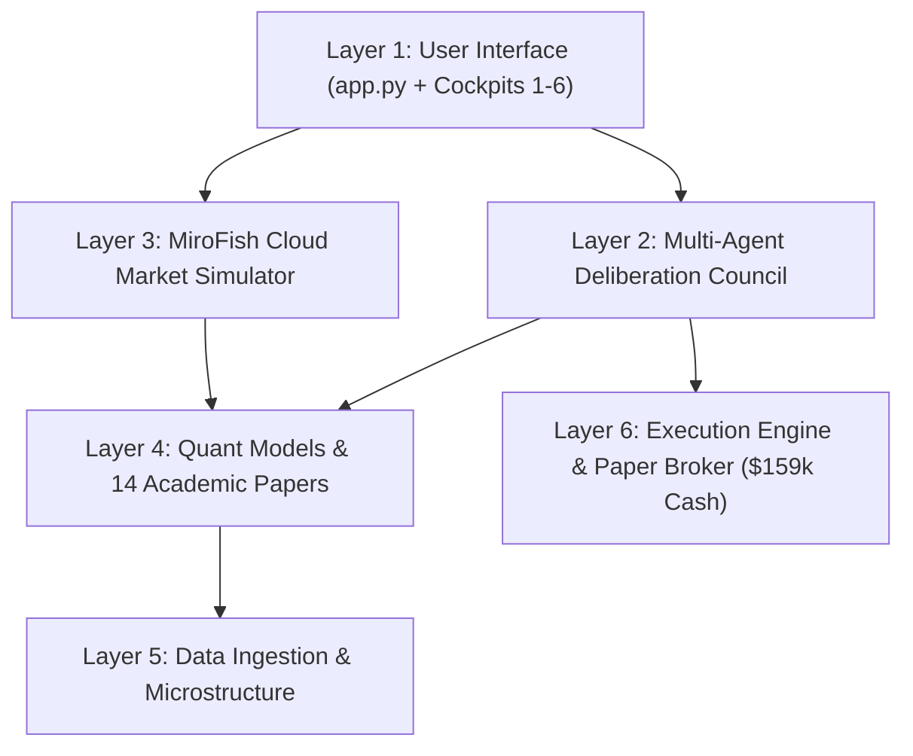

# Sentilyze Trading OS: Developer & Quantitative Onboarding Guide

*Generated by Understand-Anything (`understand-onboard`) on 2026-09-20.*

---

## 1. Project Overview

| Metric | Value |
| :--- | :--- |
| **Platform Name** | **Sentilyze Trading OS** |
| **Architecture** | High-Speed 6-Cockpit Mission Control Station |
| **Language** | **Python 3.13+ ONLY** (Strict User Rule) |
| **Frontend** | **Streamlit** (Layout="wide", theme engine) |
| **Models** | XGBoost (`.json` format ONLY), FinBERT, PyTorch, Scikit-Learn |
| **Hardware Footprint** | Optimized for low-power laptop (CPU < 1%, RAM < 15MB added, 0% GPU) |
| **Live Paper Cash Balance** | **$159,199.62** (Strict Preservation Mandate) |

---

## 2. Architecture Layers



### Layer Details:
1. **User Interface & Cockpit Layer (`src/ui/`)**:
   - `app.py`: Top global portfolio ribbon, theme switcher, and router for 6 Cockpits.
   - Cockpit 1: `cockpit_trading.py` (Live signals, 8-Agent War Room, Autonomous Trader).
   - Cockpit 2: `cockpit_smart_money.py` (Dark pools, 8-K filings, social sentiment).
   - Cockpit 3: `cockpit_portfolio.py` (Master fund equity curve, beta hedging).
   - Cockpit 4: `cockpit_backtest.py` (WFO, Trade autopsy, PDF Tearsheet).
   - Cockpit 5: `cockpit_deep_quant.py` (SHAP XAI, GNN contagion, Stat-Arb).
   - Cockpit 6: `ws_strategy_incubator.py` (MiroFish Cloud Market Simulator & Genetic Breeder).
2. **Multi-Agent Deliberation Layer (`src/agent_committee.py`)**:
   - 8 specialized agents vote on every asset: Technical Alpha, Sentiment Catalyst, Fundamental Valuation, CRO Risk Officer, Regulatory, Macro, Stat-Arb, and Memory.
3. **MiroFish Multi-Agent Cloud Simulator (`src/cloud_market_simulator.py`)**:
   - Simulates 5 virtual market actors (Smart Money, HFT, Retail FOMO, Contrarian Short, Risk Officer).
   - Offloads complex reasoning to Google Gemini Cloud API in ~2 seconds.
4. **Academic Research Papers Suite (`src/academic_papers_benchmark.py`)**:
   - 14 empirical mathematical strategies (Hazan ONS, Boyd SOCP, Triple-Barrier ATR, Fractional Kelly, etc.).
5. **Execution & Strict Portfolio Broker (`src/paper_broker.py`)**:
   - Strict adherence to live state preservation ($159,199.62 cash buffer, 53 historical trades, 83.02% win rate).

---

## 3. Key Concepts & Non-Negotiable Rules

> [!CAUTION]
> **STRICT PORTFOLIO PRESERVATION RULE**:
> `results/paper_portfolio.json` and `results/executed_trades.csv` represent the live paper trading state. **NEVER** reset, delete, overwrite with placeholder data, or wipe during any test runs, builds, or CI workflows. Tests must ALWAYS use temporary mock brokers (`tmp_path`).

> [!IMPORTANT]
> **NO PICKLE / JOBLIB RULE**:
> Machine learning models must **NEVER** use `joblib` or `pickle` due to CodeQL `py/unsafe-deserialization` vulnerabilities. Always serialize with XGBoost's native `.json` format (`model.save_model()` / `model.load_model()`).

---

## 4. Guided Tour: 5 Steps to Understand the System

1. **Step 1: Entry Point (`app.py`)**
   - Start at `app.py`. Trace how `render_top_global_ribbon()` reads live cash equity and routes to each cockpit function.
2. **Step 2: Council Deliberation (`src/agent_committee.py`)**
   - Read `convene_trading_committee()`. Notice how each specialist scores confidence $\in [0, 1]$ and the Chief Risk Officer applies Kelly capital sizing.
3. **Step 3: MiroFish Market Simulator (`src/cloud_market_simulator.py`)**
   - Inspect `CloudMarketSimulator.run_simulation()`. See how real spot snapshots and macro shocks are sent to Gemini Cloud and cleared via Kyle's Lambda.
4. **Step 4: Academic Papers Benchmark (`src/academic_papers_benchmark.py`)**
   - Explore how Boyd Convex SOCP, Hazan Online Newton Step, and Triple-Barrier ATR corridors are evaluated head-to-head.
5. **Step 5: Paper Broker Ledger (`src/paper_broker.py`)**
   - Review how `execute_order()` logs trades, calculates slippage, and locks realized gains.

---

## 5. Complexity Hotspots

| Module | Complexity | Why It Requires Care |
| :--- | :---: | :--- |
| `src/agent_committee.py` | **High** | Multi-threaded deliberation, trailing win-rate weight calibration, and consensus quorum logic. |
| `src/convex_optimizer.py` | **High** | Polynomial SOCP solver balancing risk aversion against quadratic transaction friction. |
| `src/paper_broker.py` | **High** | Safety-critical ledger logic protecting real cash balance ($159,199.62). |
| `src/cloud_market_simulator.py` | **Medium** | Cloud API payload formatting, timeout handling, and deterministic fallback matching. |

---

## 6. How to Run Locally

1. **Launch Streamlit Dashboard**:
   ```powershell
   .venv\Scripts\python.exe -m streamlit run app.py
   ```
2. **Execute Full Test Suite**:
   ```powershell
   .venv\Scripts\python.exe -m pytest -q
   ```
3. **Code Formatting Check**:
   ```powershell
   .venv\Scripts\python.exe -m black --check .
   ```
